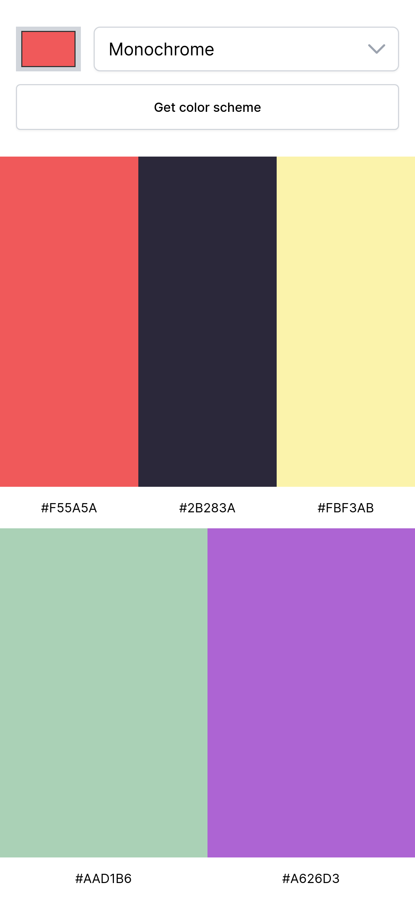
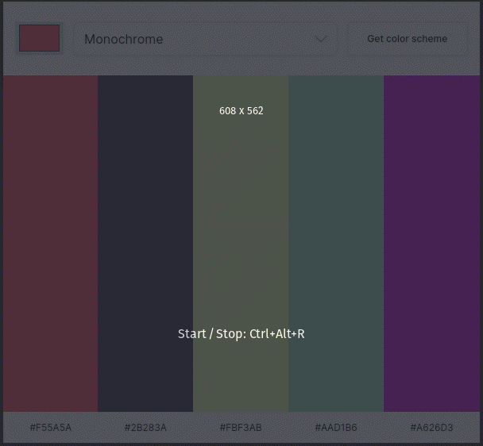

# Color Scheme Generator

A solo project from the [Scrimba Frontend Developer Career Path](https://scrimba.com/learn/frontend)

## Table of contents

- [Overview](#overview)
  - [Requirements](#requirements)
  - [Screenshots](#screenshots)
  - [Links](#links)
- [My process](#my-process)
  - [Useful resources](#useful-resources)
- [Acknowledgments](#acknowledgments)

## Overview

### Requirements

- [x] Choose "seed color" with an \<input type="color" />
- [x] Choose color scheme mode in a \<select> box
- [x] Clicking button makes request to [The Color API](https://www.thecolorapi.com/) to get a color scheme
- [x] Display the scheme colors and hex values on the page
- [x] Stretch goal: click hex values to copy to clipboard

### Screenshots

### Links

- Live Site URL: [https://joshjavier.github.io/color-scheme-generator/](https://joshjavier.github.io/color-scheme-generator/)
- Scrim URL: [https://scrimba.com/scrim/co0bb491ca32e79bd45fdf4cb](https://scrimba.com/scrim/co0bb491ca32e79bd45fdf4cb)

## My process

### Useful resources

- [Cards](https://inclusive-components.design/cards/) - This is a gift that keeps on giving. Whenever I find myself creating some sort of card element, I'd always refer to this article for best practices. The pseudo-content trick and progressive enhancement concepts greatly influenced my implementation for the card strips on this project.

## Acknowledgments

Shout out to Thalita for validating my assumptions and pointing me in the right direction re: a bug in Scrimba that prevents the button click from being triggered.
